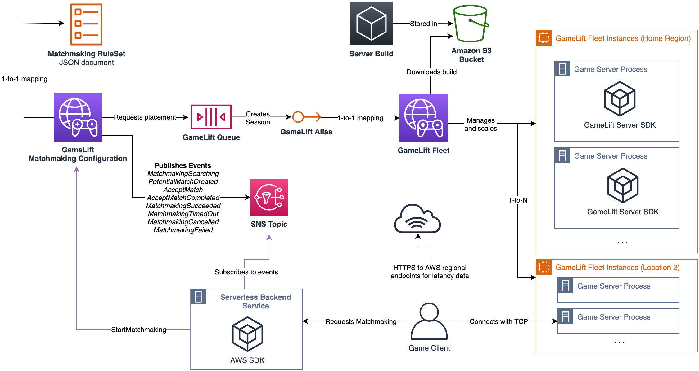

# GameLift Example with Serverless Backend: C++ Version Server and Client

This subfolder contains the details for the C++ -based game server and client. See the [main README](../README.md) for details on the backend architecture.

# Key features
* **C++-based Game Server running on Amazon Linux 2**
    * Amazon GameLift with a setup for all key aspects of GameLift Server implementation and a simple TCP server to validate player session tokens
* **C++-based Game Client using the AWS C++ SDK**
    * Communicates with Amazon Cognito and uses Cognito credentials to sign requests against Amazon API Gateway. Also includes a simple TCP client to connect to the game server
* **Works fully with the whole backend of the main example**
    * Including Amazon Cognito authenticated requests to Amazon API Gateway, latency measurements against the different Amazon GameLift Locations, and pushing server logs to CloudWatch Logs
* **Uses all the same CloudFormation templates as the main example**

**Note**: _“The sample code; software libraries; command line tools; proofs of concept; templates; or other related technology (including any of the foregoing that are provided by our personnel) is provided to you as AWS Content under the AWS Customer Agreement, or the relevant written agreement between you and AWS (whichever applies). You should not use this AWS Content in your production accounts, or on production or other critical data. You are responsible for testing, securing, and optimizing the AWS Content, such as sample code, as appropriate for production grade use based on your specific quality control practices and standards. Deploying AWS Content may incur AWS charges for creating or using AWS chargeable resources, such as running Amazon EC2 instances or using Amazon S3 storage.”_

# Architecture Diagram

The architecture diagram introduced here focuses on the GameLift resources.

### GameLift Resources

# Preliminary Setup

The easiest way to test the example is to use an **AWS Cloud9** environment. [AWS Cloud9](https://aws.amazon.com/cloud9/) is a cloud-based IDE running on an Amazon Linux 2 instance. It's perfect for GameLift server development as the environment is the same as the final execution environment on GameLift. It's possible to run all the scripts over SSH or Session Manager session to an Amazon Linux 2 instance as well.

1. **Setup Cloud9 Development environment**
    * **Create the Cloud9 environment**
        * Open the AWS Management Console and select a Region where you want to run the IDE. The best option is one close to your physical location for low latency.
        * Open Cloud9 service and select "Create Environment"
        * Select a name such as "GameLift Cpp Example" and click "Next Step"
        * Leave everything else as it is (you should have Amazon Linux 2 selected for the platform) and **select the m5.large** instance to make sure we have a fast and fluent build experience
        * Select "Next Step"
        * Select "Create Environment"
    * **Resize the Cloud9 environment volume**
        * Open Cloud9 management console again in another tab, click on the name of the Cloud9 Environment and select "Go to Instance"
        * Click on the Instance ID
        * Select "Storage" and click on the volume-id
        * Select Actions -> Modify Volume, set the size to 40 and click "Modify" and then "Yes"
        * Go back to instances and select the Cloud9 instance checkbox
        * Select Instance State -> Reboot Instance and click "Reboot"
    * Go Back to the Cloud9 enviroment tab and you should see it connecting back after the reboot. We now have the development environment set up with sufficient disk space for building all the SDKs!
2. **Clone this repository to the Cloud9 instance**
    * Select the terminal in the bottom of the editor in Cloud9
    * Run `git clone https://github.com/aws-samples/aws-gamelift-and-serverless-backend-sample.git`
    * Run `cd aws-gamelift-and-serverless-backend-sample/` to open the folder

# Deployment

The backend deployment steps 1-3 are here for convenience, you might have done them already.

1. **Set up your configuration** (`configuration.sh`)
    * Modify the script to set the `region` variable to your selected region for the backend services and GameLift resources
    * Modify the script to set the `deploymentbucketname` to a **globally unique** name for the code deployment bucket
    * Set the `secondaryregion` variable in the script to your selected secondary location as we're running the Fleet in two different Regions
2. **Deploy the Backend API and PreRequirements stacks** (`deployBackendAndPreRequirements.sh`)
    * Make sure you have the SAM CLI installed
    * Run the script to deploy the backend API and the PreRequirements Stack (`deployBackendAndPreRequirements.sh`)
    * This will run two scripts to deploy both the serverless backend with SAM (GameServiceAPI/deploy.sh) as well as the Cognito and IAM resources we need for configuration with CloudFormation (FleetDeployment/deployPreRequirements.sh).
3. **Set the role to CloudWatch Agent configuration** (`CppServerAndClient/ServerBuild/amazon-cloudwatch-agent.json`)
    * Open file CppServerAndClient/ServerBuild/amazon-cloudwatch-agent.json in the Cloud9 editor
    * Replace the `role_arn` value with role provided as output by the previous script
    * You can also find the ARN in the CloudFormation stack, in IAM console or as output of Step 2
    * **NOTE**: This is **not** the file in the LinuxServerBuild folder in the root which is used by the Unity version of the example!
4. **Set the API endpoint and the Cognito Identity Pool in the Client Project** (`CppServerAndClient/Client/Client.h`)
    * Open the file CppServerAndClient/Client/Client.h in the Cloud9 editor
    * Set the value of `String backendApiUrl` to the endpoint created by the backend deployment. You can find this endpoint from the `gameservice-backend` Stack Outputs in CloudFormation, from the SAM CLI stack deployment outputs or from the API Gateway console (make sure to have the `/Prod/` in the url)
    * Set the value of `String identityPoolId` to the identity pool created by the Pre-Requirements deployment. You can find the ARN in the CloudFormation stack, in the Amazon Cognito console or as the output of Step 2.
    * Set the values of `const char* REGION` and `String regionString` to the applicable values of your selected main region. Set the value of `String secondaryRegionString` to a GameLift supported Location region. These two regions will be used based on the latencies provided by the clients to the matchmaking.
5. **Download, Build and setup the GameLift C++ Server SDK**
    * Open the CppServerAndClient folder (`cd CppServerAndClient`) in the Cloud9 terminal
    * Run the script `./SetupGameLiftSDK.sh`to download, build and configure the GameLift Server SDK. This script will copy the relevant files under the Server project as well.
    * **NOTE**: This will take some time as it downloads a number of dependencies and builds the SDK
    * Make sure this completes without errors by checking that the `CppServerAndClient/Server/` folder now has subfolders `include` and `lib`
6. **Download and Build the AWS SDK for C++**
    * Run the script `./SetupAWSSDK.sh` to download, build and configure the AWS SDK for C++. This script will make the AWS Core and Amazon Cognito libraries available on this maschine so we don't need to copy them anywhere separately.
    * **NOTE**: This will also take some time as it downloads the whole SDK and builds the relevant parts
6. **Build the server and Deploy the build and the GameLift resources** (`CppServerAndClient/BuildAndDeployCppGameServerAndUpdateGameLiftResources.sh`)
    * You can test that the server compiles correctly by going to `CppServerAndClient/Server/` in the terminal and running `./build.sh`
    * go to `CppServerAndClient` in the Cloud9 terminal and run `./BuildAndDeployCppGameServerAndUpdateGameLiftResources.sh` to Build the server, upload it to GameLift and deploy all the GameLift resources with CloudFormation. This will take time as it will create a GameLift Fleet and deploy game servers to two different Regions. The CloudFormation wait might time out but you can check the progress also in the CloudFormation and GameLift management consoles.
7. **Build and run two clients**
    * Open `CppServerAndClient/Client/` in two Cloud9 terminals (You can create a new one from the "+" icon)
    * Run `./build.sh` in one of the terminals
    * Run `./client` in both terminals to start two clients that request a new Cognito identity, call the API Gateway to request matchmaking and connect to the game server after matchmaking is done. The client terminates immediately after validating the player session token with the game server over TCP. The game server will terminate after 10 seconds from 2 successful clients connecting.

# Implementation Overview

## GameLift Resources

The GameLift resources are deployed with `gamelift.yaml` template. The stack is named **GameLiftExampleResources**

### GameLiftExampleResources Stack

  * a **FlexMatch Matchmaking Rule Set** that defines a single team with 1 to 5 players and a requirement for the player skill levels to be within a distance of 10. All players will have the same skill level in the example that is stored in DynamoDB by the backend service. The FlexMatch Rule Set also defines a latency requirement of < 50ms for the clients. This is relaxed to 200ms after 10 seconds. The clients make HTTPS requests to Amazon endpoints to measure their latency and send this data to the backend which forwards it to the matchmaker. NOTE: The C++ server only accepts 2 clients and terminates the session. See the Unity example for more complete management of backfilling up to 5 players and terminating backfill tickets with game server termination.
  * a **FlexMatch Matchmaking Configuration** that uses the Rule Set and routes game session placement requests to the Queue. It also uses automatic backfilling to add players to existing matches up to the max players.
  * a **GameLift Queue** that is used to place game sessions on the GameLift Fleet. In the example we have a single fleet behind the Queue and it has two Regional locations (home Region and one secondary Region Location). You could have multiple Fleets within the Home Region (for example a Spot Fleet and a failover On-Demand Fleet for cost optimization). The queue has latency configuration for selecting the best Region for each group of players generated by FlexMatch based on their latency.
  * a **GameLift Fleet** that sits behind the Queue and uses the latest game server build uploaded by the `deployBuildAndUpdateGameLiftResources.sh` script. The Fleet has two Regional locations and runs on Amazon Linux 2 and there are two game server processes running on each instance. The ports for the processes are defined as parameters to the game server process and matching ports are enabled for inbound traffic to the fleet. You can pack more game servers on each instance based on the instance size and the resource requirements of your server. Our example uses C5.large instance type which is a good starting point for compute intensive workloads. We will call the update-fleet-capacity with the AWS CLI to set both the scaling of both locations to min 1, max 2 and desired of 1 instances. To set the scaling policy to target 20% available game sessions, we do a separate call to the put-scaling-policy API at the end of the script. NOTE: This policy won't trigger in the sample configuration when you have 1 instance full in a Region, because 20% of 1 rounds down to 0. However, on an actual production workload where you typically run 10s of game servers, 20% is a good starting point for available game sessions.

You can refer to the [main README](../README.md) for details on the backend resources and the overall architecture. This section contains only the details of the C++ server and client.

The server and the client are both Linux C++ applications that we run on Amazon Linux 2. It is recommended to use a Linux game server for efficient use of resources and faster startup times than Windows instances. You can integrate the GameLift logic found in this example to your own custom C++ server.

To build a Windows-based game client instead of the included Linux client, you can follow the instructions on [Building the AWS SDK for C++ on Windows](https://docs.aws.amazon.com/sdk-for-cpp/v1/developer-guide/setup-windows.html) to set up the SDK and bring the code files of the client to a Visual Studio project and configure it with the AWS C++ SDK. In the example we run the client on AWS Cloud9 as well for simplicity.

## Game Server

The Game Server is a C++ application that makes use of the [GameLift Server SDK](https://docs.aws.amazon.com/gamelift/latest/developerguide/gamelift-supported.html) to communicate with GameLift. It works with GameLift Local which you can use to [test your integration locally](https://docs.aws.amazon.com/gamelift/latest/developerguide/integration-testing-local.html). It also implements a minimalistic blocking TCP Server that accepts two clients one by one and validates the Player Session ID:s received from the client. This can be used to make sure the correct players are connected to the server.

**NOTE**: The purpose of this example is not to demonstrate TCP client-server networking architecture and you will need to replace the socket implementation with a properly threaded/asynchronous design, commonly implemented with libraries such as Boost.Asio or higher level game networking libraries.

The game server writes output using the same log file structure as the main example. This will allow the CloudWatch Agent installed with the install.sh script on the GameLift Fleet instances to push logs for the two servers running on every instance independently to CloudWatch Logs. You can find the server output logs in CloudWatch Logs in the log group "GameServerLogs".

**Code files:**
  * `Server.h`: Declares the Server class and all the related GameLift callbacks
  * `Server.cpp`: Implements the Server class and contains the entry point of the application. In the `main()`-function we
      * Get the port from arguments (provided in the Fleet configuration)
      * Initialize GameLift with appropriate port, logfile and other configuration and set the callbacks to the Server class
      * Start a simple TCP server and accept two connections. We also validate the Player Session ID received from the client
      * Wait 10 seconds and terminate the program. The GameLift Fleet will then start a new server as a replacement.

## Game Client

The Game Client implements a minimal client to get Cognito identity and credentials, Check latencies against the two Regions where we host the game servers, Request matchmaking through the API with the latencies, and connect to the game server over TCP and send the Player Session ID for validation. It makes use of the [AWS SDK for C++](https://aws.amazon.com/sdk-for-cpp/) to request the Cognito Identity and credentials as well as to sign the requests against the API Gateway with SigV4. The AWS SDK for C++ provides useful helpers for Json and HTTP as well that we use in the example.

**Code files:**
  *  `Client.h`: Contains the configuration for the client including the Cognito Identity Pool, the backend API URL and the Regions to do latency testing against. You will need to set these variables to the appropriate values for your specific configuration.
  * `Client.cpp`: The `main()`-function of the application that will:
      * Connect to Amazon Cognito to get a Cognito identity and credentials (NOTE: This will always get a new identity, you should cache this in your own game client)
      * Check the latencies against the two Regions by doing three HTTP requests against DynamoDB endpoints in the Regions. The first request is used to establish an HTTP connection and the two requests after that to check the average latency over TCP (now that the connection is already open).
      * Sign the request and call the `requestmatchmaking` API with the latencies
      * Sign the request and call the `checkmatchstatus` API with the matchmaking ticket ID with a 2s interval for 20 seconds (after this the matchmaking has timed out)
      * Connect to the server with a TCP client and send the Player Session ID for validation
      * Receive the validation result and stop the client

## Clean up

To delete the resources created in the example, go to **CloudFormation console** and delete the stacks one by one in this order:

1. GameliftExampleResources
2. GameLiftExamplePreRequirements
3. gameservice-backend

In addition you can empty and delete the the bucket that contains the deployment assets for SAM:

1. Go to S3 Console
2. Select the bucket name you selected when deploying
3. Select "Empty" to empty the contents of the bucket and follow the instructions
4. Select "Delete" for the empty bucket and follow the instructions

# License

This example is licensed under the Apache 2.0 License. See LICENSE file.
