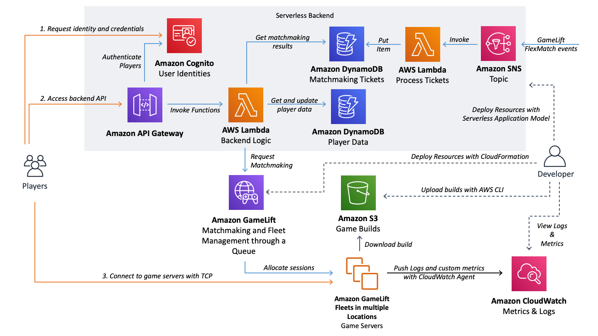

# DEPRECATED: ONLY FOR LEGACY NEEDS FOR GAMELIFT SERVER SDK 4

Please refer to [Amazon GameLift Integration in the AWS Game Backend Framework](https://github.com/aws-solutions-library-samples/guidance-for-custom-game-backend-hosting-on-aws/tree/main/BackendFeatures/AmazonGameLiftIntegration) for the latest version of this guidance

# Multiplayer Session-based Game Hosting on AWS

  * [Key Features](#key-features)
  * [Contents](#contents)
  * [Architecture Diagram](#architecture-diagram)
  * [Preliminary Setup for the Backend](#preliminary-setup-for-the-backend)
  * [Deployment with Bash Scripts](#deployment-with-bash-scripts)
  * [Deployment with PowerShell Scripts](#deployment-with-powershell-scripts)
  * [Implementation Overview](#implementation-overview)
    + [Serverless Backend Service](#serverless-backend-service)
  * [License](#license)

This repository contains a solution for multiplayer session-based game hosting on AWS leveraging Amazon GameLift, a fully managed game server hosting solution, with a serverless backend service. The solution is designed for getting quickly started with multiplayer game development on macOS and Windows. It includes infrastructure as code automation, as well as deployment scripts to deploy all the required resources, and supports Unity and custom C++ engines.

This Readme includes the architecture overview, as well as deployment instructions and documentation for the serverless backend services of the solution. You can then branch out to the Unity and C++ specific Readmes ([Unity deployment README](README_UnityClientServer.md) or [C++ deployment README](CppServerAndClient/README.md)) as needed for the game client, game server setup and GameLift resources setup.

**Note**: _“The sample code; software libraries; command line tools; proofs of concept; templates; or other related technology (including any of the foregoing that are provided by our personnel) is provided to you as AWS Content under the AWS Customer Agreement, or the relevant written agreement between you and AWS (whichever applies). You should not use this AWS Content in your production accounts, or on production or other critical data. You are responsible for testing, securing, and optimizing the AWS Content, such as sample code, as appropriate for production grade use based on your specific quality control practices and standards. Deploying AWS Content may incur AWS charges for creating or using AWS chargeable resources, such as running Amazon EC2 instances or using Amazon S3 storage.”_

# Key Features
* Uses CloudFormation to automate the deployment of all resources
* Uses Serverless APIs built with Serverless Application Model for backend functionalities such as matchmaking requests
* Leverages FlexMatch latency-based matchmaking
* Runs on Amazon Linux 2 on the GameLift service in two regional locations
* Uses Cognito Identity Pools to store user identities and authenticate the users against the backend
* Deployed with shell (macOS) or PowerShell (Windows) scripts
* Includes configuration to push custom logs and metrics to CloudWatch with CloudWatch Agent
* Includes automated CloudWatch Dashboards for both the backend and game server resources
* Client works on multiple platforms including mobile
* Provides Unity and C++ example implementations for client and server
* Provides a serverless bot client load testing option for the Unity deployment by leveraging AWS Fargate

The project is a simple "game" where 1-5 players join the same session and move around with their 3D characters. The movement inputs are sent to the server which runs the game simulation on a headless Unity process and syncs state back to all players. The C++ implementation focuses on the integrations only and doesn't run simulation for the client and server.

# Contents

The project contains:
* **A Backend Project** created with Serverless Application Model (SAM) to create the serverless APIs for matchmaking requests (`GameServiceAPI`)
* **Fleet deployment automation** leveraging AWS CloudFormation to deploy all GameLift resources (`FleetDeployment`)
* **A build folder for the server build** which includes a set of pre-required files for configuration and where you will build your Linux server build from Unity or C++ (`LinuxServerBuild`)
* **A Unity version of the game server and client** (`GameLiftExampleUnityProject`)
* **A C++ version of the game server and client** (`CppServerAndClient`)
* **Unity bot client infrastructure implementation** (`UnityBotClient`)

# Architecture Diagram

The architecture diagram introduced here focuses on the serverless backend but it also includes the GameLift components on a high level. See the Unity and C++ Readme-files for detailed GameLift resource diagrams.

See [Reference Architecture for Multiplayer Session-based Game Hosting](https://docs.aws.amazon.com/architecture-diagrams/latest/multiplayer-session-based-game-hosting-on-aws/multiplayer-session-based-game-hosting-on-aws.html) for a step by step overview of the flow of events.

### Serverless Backend

# Preliminary Setup for the Backend

1. **Clone the repository**:
  * `git clone https://github.com/aws-samples/aws-gamelift-and-serverless-backend-sample.git`
2. **Make sure you have the following tools installed**
    1. **Install and configure the AWS CLI**
        * Follow these instructions to install: [AWS CLI Installation](https://docs.aws.amazon.com/cli/latest/userguide/cli-chap-install.html)
        * Configure the CLI: [AWS CLI Configuration](https://docs.aws.amazon.com/cli/latest/userguide/cli-chap-configure.html#cli-quick-configuration)
    2. **Install SAM CLI**
        * Follow these instructions to install the Serverless Application Model (SAM) CLI: [SAM CLI Installation](https://docs.aws.amazon.com/serverless-application-model/latest/developerguide/serverless-sam-cli-install.html)
    3. **Install Node.js 16.20.0(LTS)**
        * Required for the SAM build: [Node.js Downloads](https://nodejs.org/en/blog/release/v16.20.0). If you need help switching between Node versions, you can use [nvm] to do that easily (https://github.com/nvm-sh/nvm).
3. **Select deployment Region**
    * The default AWS Regions for the solution are us-east-1 for backend and GameLift home region and us-west-2 for GameLift secondary region. The fastest option is to not modify these. The solution can however be deployed in any AWS Region that supports Amazon GameLift FlexMatch. For details see the [Amazon GameLift FAQ](https://aws.amazon.com/gamelift/faq/) and look for "In which AWS Regions can I place a FlexMatch matchmaker?"

# Deployment with Bash Scripts

Note: If you want to do the end to end deployment in a Cloud9 browser IDE for the C++ solution, please refer to the [C++ deployment README](CppServerAndClient/README.md) for details on how to set that up.

Before starting, navigate to the repository root in your terminal and open the project in your favourite code editor.

1. **Set up your configuration** (`configuration.sh`)
    * Set the `region` variable to your selected region for the backend services and GameLift resources
    * Set the `deploymentbucketname` to a **globally unique** name for the code deployment bucket. The deployment script in step 2 will create this S3 bucket for storing backend code artifacts.
    * Set the `secondaryregion` variable in the script to your selected secondary location as we're running the game server fleet in two different Regions
2. **Deploy the Backend API and PreRequirements stacks** (`deployBackendAndPreRequirements.sh`)
    * Run the script to deploy the backend API and the PreRequirements Stack (`./deployBackendAndPreRequirements.sh`)
    * This will run two scripts to deploy both the serverless backend with SAM (*GameServiceAPI/deploy.sh*) as well as the Cognito and IAM resources we need for configuration with CloudFormation (*FleetDeployment/deployPreRequirements.sh*).
    * The script will automatically replace the `role_arn` value in `LinuxServerBuild/amazon-cloudwatch-agent.json` with the one created by the stack. This is used later on to configure CloudWatch Agent to send server logs and metrics to.
3. **Move to Unity or C++ instructions** for the game server and client builds deployment
    * [Unity deployment README](README_UnityClientServer.md)
    * [C++ deployment README](CppServerAndClient/README.md)

# Deployment with PowerShell Scripts

Before starting, navigate to the repository root in your Powershell and open the project in your favourite code editor.

1. **Set up your configuration** (`configuration.xml`)
    * Set the `Region` value to your selected region for the backend services and GameLift resources
    * Set the `DeploymentBucketName` to a **globally unique** name for the code deployment bucket. The deployment script in step 2 will create this S3 bucket for storing backend code artifacts.
    * Set the `SecondaryRegion` value in the script to your selected secondary location as we're running the game server fleet in two different Regions
2. **Deploy the Backend API and PreRequirements stacks** (`deployBackendAndPreRequirements.ps1`)
    * Run the script to deploy the backend API and the PreRequirements Stack (`./deployBackendAndPreRequirements.ps1`)
    * This will run two scripts to deploy both the serverless backend with SAM (*GameServiceAPI/deploy.ps1*) as well as the Cognito and IAM resources we need for configuration with CloudFormation (*FleetDeployment/deployPreRequirements.ps1*).
    * Select 'R' if prompted to run the individual scripts
    * Replace the value of `role_arn` in `LinuxServerBuild/amazon-cloudwatch-agent.json` with the one created by the stack. You can find this as an output of the deployment script or as an Output of the GameLiftExamplePreRequirements stack in CloudFormation. This is used later on to configure CloudWatch Agent to send server logs and metrics to.
3. **Move to Unity instructions** for the game server and client builds deployment. C++ deployment doesn't support Windows currently.
    * [Unity deployment README](README_UnityClientServer.md)

# Implementation Overview

## Serverless Backend Service

The backend service is Serverless and built with Serverless Application Model. The AWS resources are defined in the SAM template `template.yaml` within the GameServiceAPI folder. SAM CLI uses this template to generate the `gameservice.yaml` template that is then deployed with CloudFormation. SAM greatly simplifies defining Serverless backends.

The backend contains three key Lambda functions: **RequestMatchmakingFunction** and **RequestMatchStatusFunction** are defined as Node.js scripts within the gameservice folder. These functions are called by the API Gateway defined in the template that uses AWS_IAM authentication. Only signed requests are allowed and the different client implementations use Cognito credentials to sign the requests. This way we also have their **Cognito identity** available within Lambda functions. The identity is used to securely identify users and access their data in DynamoDB.

**ProcessMatchmakingEventsFunction** is triggered by Amazon SNS events published by GameLift FlexMatch. It will catch the MatchmakingSucceeded events and write the results in DynamoDB Table *"GameLiftExampleMatchmakingTickets"*. RequestMatchStatusFunction will use the DynamoDB table to check if a ticket has succeeded matchmaking. This way we don't need to use the DescribeMatchmaking API of GameLift as the API can easily throttle with a large player count as is not designed for production use. The DynamoDB Table also has a *TTL* field and TTL configuration, which means the tickets will be automatically removed after one hour of creation.

The SAM template defines IAM Policies to allow the Lambda functions to access both GameLift to request matchmaking, as well as DynamoDB to access the player data. It is best practice to never allow game clients to access these resources directly as this can open different attack vectors to your resources.

### GameLiftExamplePreRequirements Stack

  * an **IAM Role** for the GameLift Fleet EC2 instances that allows access to CloudWatch to push logs and custom metrics. It is created already at this point to configure the CloudWatch Agent before deploying the GameLift fleet.
  * a **Cognito Identity Pool** that will be used to store player identities and the associated **IAM Roles** for unauthenticated and authenticated users, which clients use to access the backend APIs through API Gateway. We don't authenticate users in the example, but you could connect their Facebook, Google or Apple identities, or any custom identities to by leveraging [Cognito external identities](https://docs.aws.amazon.com/cognito/latest/developerguide/external-identity-providers.html).
  * a **CloudWatch Dashboard** (*GameLift-Game-Backend-Metrics*) that aggregates a number of metrics from the backend including API Gateway, Lambda and DynamoDB metrics.

# License

This example is licensed under the Apache 2.0 License. See LICENSE file.
